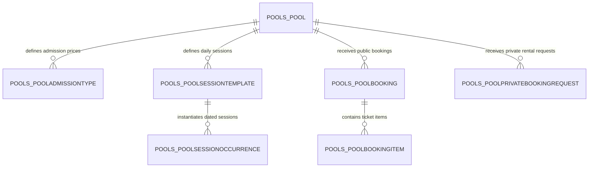

# Database Schema & Pricing Architecture Documentation

This document provides a detailed breakdown of the PostgreSQL database schema (`indoor_booking`) covering **Sport Pricing**, **Private Booking Pricing**, and the complete **Pool / Swimming Pool Architecture**.

---

## 1. Environment & Database Configuration

- **Database Engine**: PostgreSQL (`pgsql`)
- **Database Name**: `indoor_booking`
- **Host**: `127.0.0.1` / `localhost`
- **Primary Schema**: `public`

---

## 2. Sport Pricing & Private Booking Schema

### 2.1 Table: `booking_sport` (Complete 27-Column Schema)
Defines the available sports/games, court counts, base hourly rates, pricing overrides, blocked slots, and private booking pricing parameters per venue.

| # | Column | Data Type | Nullable | Description / Default / Notes |
| :-: | :--- | :--- | :--- | :--- |
| 1 | `id` | `bigint` | NO | Primary Key (Unique Sport ID) |
| 2 | `name` | `varchar` | NO | Sport name (e.g. `Cricket & Football`, `Badminton`, `Tennis`, `Pools`, `Gym`) |
| 3 | **`price`** | `numeric(10,2)` | NO | Base price per hour/slot (e.g. `2500.00`) |
| 4 | `image` | `varchar` | NO | Sport cover image URL/path |
| 5 | `available` | `boolean` | NO | Availability status flag (`true`/`false`) |
| 6 | `game_type` | `varchar` | YES | Game classification (e.g. `Indoor`, `Outdoor`, `Team`) |
| 7 | `rate_type` | `varchar` | YES | Rate billing type (e.g. `Per hour`, `Per session`) |
| 8 | `maximum_court` | `integer` | YES | Total available courts for this sport (e.g. `1`, `2`, `3`) |
| 9 | `status` | `varchar` | NO | Sport status (`Active`, `Inactive`) |
| 10 | `description` | `text` | YES | Extended sport description & rules |
| 11 | `additional_charges` | `jsonb` | YES | Extra equipment, lighting, or referee charges (JSON) |
| 12 | `advance_required` | `boolean` | NO | Requires advance deposit for booking (`true`/`false`) |
| 13 | `average_rating` | `double precision` | NO | Customer review rating average (e.g. `4.5`) |
| 14 | `created_at` | `timestamp tz` | NO | Record creation timestamp |
| 15 | `updated_at` | `timestamp tz` | NO | Last record update timestamp |
| 16 | `venue_id` | `bigint` | NO | Foreign Key -> `booking_venue.id` |
| 17 | `blocked_slots` | `jsonb` | YES | JSON structure storing blocked/maintenance time slots per date & court |
| 18 | `opening_hours` | `jsonb` | YES | Sport-specific daily opening and closing schedule |
| 19 | `pricing_rules` | `json` | YES | Dynamic peak/off-peak and weekend pricing rule definitions |
| 20 | `advance_payment_required_override` | `boolean` | YES | Override venue-level advance deposit setting |
| 21 | `advance_payment_type_override` | `varchar` | YES | Override deposit type (`percentage` or `fixed`) |
| 22 | `advance_payment_value_override` | `numeric` | YES | Override deposit value |
| 23 | `booking_payment_mode_override` | `varchar` | YES | Override payment mode (`full`, `partial`, `pay_at_venue`) |
| 24 | **`private_booking_price`** | `numeric(10,2)` | YES | Fixed rate for full private rental (if defined) |
| 25 | **`private_booking_min_duration_minutes`** | `integer` | NO | Default: `180` (Minimum duration required for private booking in mins) |
| 26 | **`private_booking_price_multiplier`** | `numeric` | NO | Default: `1.00` (Price multiplier applied during private bookings) |
| 27 | **`private_booking_pricing_mode`** | `varchar` | NO | Default: `flat_total` or `normal_total` (Private pricing formula mode) |

#### Private Booking Pricing Modes:
1. **`normal_total`**: `Total Price = Standard Base Rate × Number of Hours`
2. **`flat_total`**: `Total Price = Private Booking Fixed Price (or Multiplier × Base Rate)`

---

### 2.2 Table: `booking_booking`
Tracks individual court time slot bookings made by venue staff or mobile app users.

| Column | Data Type | Nullable | Description / Purpose |
| :--- | :--- | :--- | :--- |
| `id` | `bigint` | NO | Primary Key |
| `user_id_id` | `bigint` | YES | Foreign Key -> `users_user.id` |
| `complex_id_id` | `bigint` | NO | Foreign Key -> `booking_venue.id` |
| `game_id_id` | `bigint` | NO | Foreign Key -> `booking_sport.id` |
| `game_name` | `varchar(100)` | NO | Name of the sport/game booked |
| `court_number` | `varchar(20)` | NO | Court identifier (e.g., `1`, `2`, `3`) |
| `booking_date` | `date` | NO | Date of the slot |
| `start_time` | `time` | NO | Slot start time (e.g. `09:00:00`) |
| `end_time` | `time` | NO | Slot end time (e.g. `10:00:00`) |
| `duration` | `integer` | NO | Slot duration in minutes (e.g. `60`) |
| `price` | `numeric(10,2)` | NO | Total price calculated for this booking slot |
| `advance_amount` | `numeric(10,2)` | NO | Required advance amount |
| `amount_paid` | `numeric(10,2)` | NO | Total payment collected so far |
| `balance_due` | `numeric(10,2)` | NO | Outstanding balance |
| **`is_private`** | `boolean` | NO | Default: `false` (Indicates if court is privately locked) |
| `status` | `varchar(20)` | NO | `Pending`, `Confirmed`, `Playing`, `Completed`, `Cancelled`, `No-Show` |
| `payment_status` | `varchar(20)` | NO | `Pending`, `Partial`, `Paid`, `Refunded` |
| `payment_method` | `varchar(50)` | YES | `cash`, `online`, `qr`, `pos`, etc. |
| `permanent_source_id` | `bigint` | YES | Foreign Key -> `booking_permanentbooking.id` (if recurring) |

---

### 2.3 Table: `booking_permanentbooking`
Manages weekly recurring permanent slot reservations for regulars/teams.

| Column | Data Type | Nullable | Description |
| :--- | :--- | :--- | :--- |
| `id` | `bigint` | NO | Primary Key |
| `user_id` | `bigint` | YES | Foreign Key -> `users_user.id` |
| `complex_id` | `bigint` | NO | Foreign Key -> `booking_venue.id` |
| `sport_id` | `bigint` | NO | Foreign Key -> `booking_sport.id` |
| `day_of_week` | `varchar(20)` | NO | e.g. `monday`, `tuesday`, `saturday` |
| `start_time` | `time` | NO | Recurring slot start time |
| `end_time` | `time` | NO | Recurring slot end time |
| `price` | `numeric(10,2)` | NO | Fixed recurring rate per session |
| `is_active` | `boolean` | NO | Active subscription flag |
| `status` | `varchar(20)` | NO | `Active`, `Paused`, `Cancelled` |

---

## 3. Swimming Pool System Architecture (`pools_*`)

The swimming pool module supports **Ticket-based Admissions** (Adult, Child, Family), **Public Capacity Sessions**, **Capacity Holds**, and **Whole-Pool Private Rentals**.

---

### 3.1 Table: `pools_pool`
Defines venue swimming pool properties, capacities, and private rental pricing rules.

| Column | Data Type | Nullable | Description |
| :--- | :--- | :--- | :--- |
| `id` | `bigint` | NO | Primary Key |
| `venue_id` | `bigint` | NO | Foreign Key -> `booking_venue.id` |
| `name` | `varchar(100)` | NO | Pool name (e.g. `Main Swimming Pool`, `Kids Splash Pool`) |
| `capacity` | `integer` | NO | Maximum concurrent swimmers allowed per session |
| `max_admissions_per_booking` | `integer` | NO | Maximum tickets per single booking (e.g. `10`) |
| `max_sessions_per_booking` | `integer` | NO | Maximum session slots bookable at once (e.g. `12`) |
| `cancellation_cutoff_hours` | `integer` | NO | Cancellation cutoff limit in hours |
| `opening_hours` | `jsonb` | NO | JSON object specifying daily open/close times |
| `blocked_slots` | `jsonb` | YES | Blackout slot definitions |
| **`private_booking_price`** | `numeric(10,2)` | YES | Rate for full private pool rental (e.g. `1000.00`) |
| **`private_request_enabled`** | `boolean` | YES | Enable/disable private pool booking requests |
| **`private_request_limit_type`** | `varchar(20)` | YES | Limit rule (`percentage` or `fixed`) |
| **`private_request_limit_value`** | `numeric(10,2)` | YES | Threshold value (e.g. `50.00`%) |

---

### 3.2 Table: `pools_pooladmissiontype`
Defines admission ticket tiers and prices per pool.

| Column | Data Type | Nullable | Description |
| :--- | :--- | :--- | :--- |
| `id` | `bigint` | NO | Primary Key |
| `pool_id` | `bigint` | NO | Foreign Key -> `pools_pool.id` |
| `name` | `varchar(50)` | NO | Ticket tier (e.g. `Adult`, `Child`, `Senior`, `Family Pass`) |
| **`price`** | `numeric(10,2)` | NO | Ticket price (e.g. `500.00`) |
| `capacity_units` | `integer` | NO | Number of capacity slots consumed (e.g. `1` for Adult, `4` for Family) |
| `requires_guest_name` | `boolean` | YES | Requires individual swimmer name |
| `is_active` | `boolean` | NO | Active ticket status |
| `sort_order` | `integer` | NO | UI display ordering |

---

### 3.3 Table: `pools_poolprivatebookingrequest`
Handles requests from customers to book out the entire pool privately.

| Column | Data Type | Nullable | Description |
| :--- | :--- | :--- | :--- |
| `id` | `bigint` | NO | Primary Key |
| `pool_id` | `bigint` | NO | Foreign Key -> `pools_pool.id` |
| `user_id` | `bigint` | YES | Foreign Key -> `users_user.id` |
| `booking_date` | `date` | NO | Requested rental date |
| `start_time` | `time` | NO | Rental start time |
| `end_time` | `time` | NO | Rental end time |
| **`price`** | `numeric(10,2)` | NO | Approved private rental fee |
| `status` | `varchar(20)` | NO | `Pending`, `Approved`, `Rejected`, `Paid`, `Cancelled` |
| `notes` | `text` | YES | Request details or staff notes |

---

### 3.4 Table: `pools_poolbooking` & `pools_poolbookingitem`

#### `pools_poolbooking` (Header Table):
- `id`: Primary Key
- `pool_id`: Foreign Key -> `pools_pool.id`
- `user_id`: Customer Foreign Key
- `total_amount`: Total price paid for admission tickets
- `status`: `Confirmed`, `Completed`, `Cancelled`
- `payment_status`: `Paid`, `Pending`, `Refunded`

#### `pools_poolbookingitem` (Line Item Table):
- `id`: Primary Key
- `booking_id`: Foreign Key -> `pools_poolbooking.id`
- `admission_type_id`: Foreign Key -> `pools_pooladmissiontype.id`
- `quantity`: Number of tickets purchased
- `unit_price`: Ticket price at purchase time
- `total_price`: `quantity × unit_price`

---

### 3.5 Table: `pools_poolsessiontemplate` & `pools_poolsessionoccurrence`
Manages pool session schedules and real-time remaining swimmer capacities.

- **`pools_poolsessiontemplate`**: Defines daily recurring pool sessions (e.g. `06:00 - 08:00 Morning Swim`, `16:00 - 18:00 Evening Swim`).
- **`pools_poolsessionoccurrence`**: Specific dated session instances tracking `booked_capacity`, `held_capacity`, and `available_capacity`.

---

## 4. Discount & Promotional Tables

| Table | Description |
| :--- | :--- |
| `booking_discount` | Core promotional coupon/discount entity (`code`, `discount_type`, `amount`, `min_spend`, `valid_from`, `valid_to`) |
| `booking_discount_sports` | Join table linking discounts to specific sports (`booking_sport.id`) |
| `booking_discount_pools` | Join table linking discounts to specific pools (`pools_pool.id`) |
| `booking_discount_venues` | Join table linking discounts to specific venues (`booking_venue.id`) |
